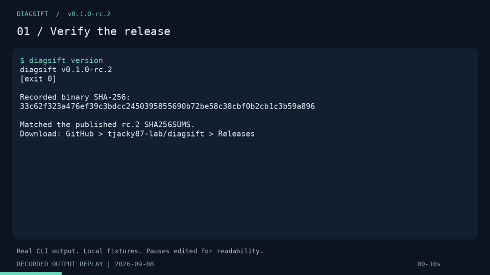

# DiagSift: public evidence

This page links to what has been built and tested, and what is still unproven.
Snapshot: 8 September 2026. DiagSift is an early-stage Apache-2.0 CLI maintained
by [tjacky87-lab](https://github.com/tjacky87-lab).

## Start here

- [80-second recorded-output demo](demo.mp4) and [readable transcript](demo.md).
- [Two reproducible support cases](cases.md), with commands, observations and limits.
- [Machine-readable run record](results.json). All data is from local fixtures.
- [Small external review tasks](../review-tasks.md).
- [Three-month maintenance plan](../maintenance-plan.md).

The video replays actual captured CLI output with edited pauses and excerpts.
It is not a recording of an independent user or a measure of task completion time.

## Evidence and its limits

| Evidence | Public record | What it establishes |
| --- | --- | --- |
| Downloadable candidate | [v0.1.0-rc.2](https://github.com/tjacky87-lab/diagsift/releases/tag/v0.1.0-rc.2) | Six platform binaries, checksums, SBOM, build provenance and three pilot packages |
| Review fixes | [PR #6](https://github.com/tjacky87-lab/diagsift/pull/6) | Concrete fixes for redaction, ZIP entries, output publication, bounded reads and pipe cleanup |
| Release preparation | [PR #7](https://github.com/tjacky87-lab/diagsift/pull/7) | Updated release documentation; merged after CI |
| Release build | [Actions run](https://github.com/tjacky87-lab/diagsift/actions/runs/34180228416) | Build from `c47cc792dcaf91a194856b0975e528deeda4da27` |
| Local reproductions | [Cases](cases.md) | Real upstream binaries, controlled fixtures, expected failures and successful corrections; useful error text survives collection |
| External interest | [restic discussion](https://forum.restic.net/t/pilot-feedback-wanted-bounded-diagnostic-bundles-for-restic-support/10966/2) | A community member expressed interest; this is not a completed trial or maintainer endorsement |
| Independent trials | [Tracker #4](https://github.com/tjacky87-lab/diagsift/issues/4), [first-time-user exercise #5](https://github.com/tjacky87-lab/diagsift/issues/5) | No completed independent trial recorded at this snapshot |

There is no measured time saving, established broad adoption, or independent
security audit in this evidence. Release-verification downloads and local tests
are internal activity. A download does not establish a unique or active user.

## What we want to learn next

Can someone who did not write the manifest preview it, collect the intended
information, and review the ZIP without step-by-step help? Does a maintainer find
the result useful in a real support case? What essential context is missing?

The existing [pilot feedback template](../../.github/ISSUE_TEMPLATE/pilot_feedback.yml)
asks for non-sensitive observations. Keep diagnostic ZIPs and private logs local.
Negative results and requests for less collection are useful evidence too.

## Codex for Open Source context

The [program](https://developers.openai.com/community/codex-for-oss) supports
maintainer work such as review, triage and release workflows. This index documents
DiagSift's actual work; it is not an assertion that the project has been accepted.
The maintenance plan explains what further support would be used for.
